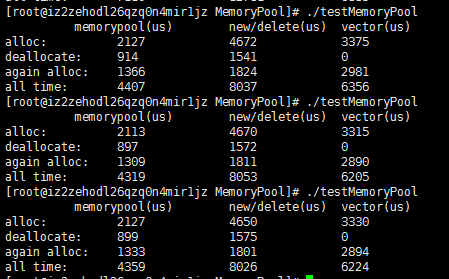

## 简洁易用的内存池
模板类实现内存池，memoryPool从堆中申请足够大小内存作为容量，然后将申请的内存划分为多个sizeof(T)字节大小的区块，区块的排列采用顺序排列和链表式排列相结合的思路。用户使用只需allocate即可获得一个区块进行使用

### 特点
1. 代码简洁
2. 接口容易使用
3. 性能足够好，经测试使用该memoryPool 比使用new/delete或者std::allocate或者vector都要好。

### 函数介绍：
void* alloChunk(); //从堆中申请大块内存

void* alloate();  //返回一个可用区块

void* deallocate(void* p);  //将p以链表节点形式插入内存池

void setHandler(Handler* han); //设置operator new 碰到内存不足时的处理函数

### 用户申请allocate步骤：
1. 先从大块内存中按照顺序排列取出区块，
2. 如果大块内存被使用完，就判断fisrtFloatBlock指向的链表节点是否存在，
3. 如果存在就返回链表中第一个区块（节点），否则就重新调用allocChunk获得大块内存。然后重复进行(1)
### 用户deallocate使用
用户deallocate（void* p）后，不会直接进行  delete p处理，而是将p作为链表节点插入内存池。

### 性能测试

测试方案：
1. 申请100000个元素大小空间，并且构造  
2. 将申请元素全部释放  
3. 然后重新申请100000个元素  
4. 计算上述3个步骤各自所花时间和三个步骤总共需要时间

测试结果如下：

从结果可以看出memory所需时间远小于new/delete或者vector

===========================================================================

### 新添加了非模板的通用内存池  
通用内存池使用不需要指定类型，但是在allocate时需要指定size，
新添加的通用内存池在universalMemoryPool目录中，而原来的模板内存池放到了templateMemoryPool目录中。

============================================================================
